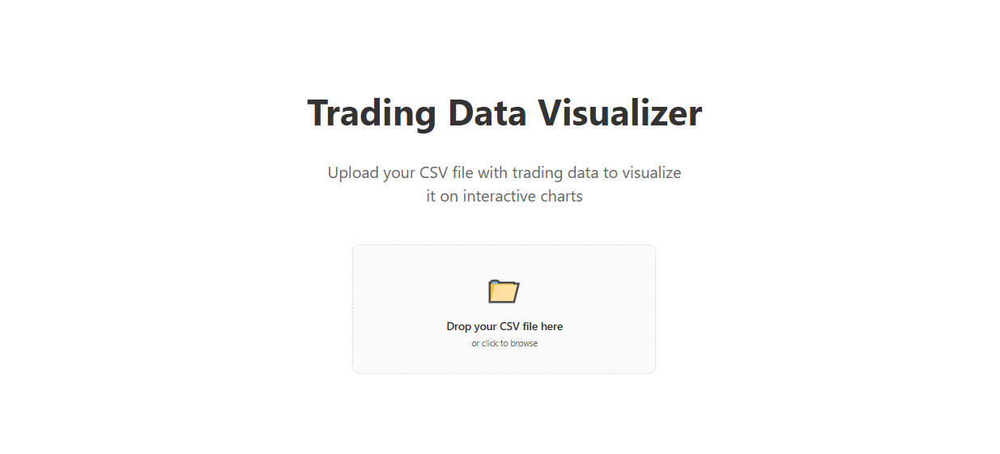

# Ruth Tester - Trading Data Visualization Platform

A modern web application for uploading, processing, and visualizing trading data with professional charts.

## 🚀 Features

- **CSV Data Upload**: Easy drag-and-drop interface for uploading trading data files
- **Real-time Chart Visualization**: Interactive candlestick charts powered by TradingView Lightweight Charts
- **Market Hours Classification**: Automatic distinction between regular trading hours and after-hours sessions
- **Gap Adjustment**: Smart processing to align trading sessions and handle price gaps
- **NY Timezone Support**: Automatic timezone conversion for accurate market hour detection
- **Responsive Design**: Works seamlessly on desktop and mobile devices

## 🛠️ Technology Stack

### Frontend

- **Next.js 16** - React framework with App Router
- **React 19** - Latest React features
- **TypeScript** - Type-safe development
- **TradingView Lightweight Charts** - Professional financial charting
- **Pure CSS** - Custom styling without frameworks

### Backend

- **FastAPI** - High-performance Python API framework
- **Pandas** - Data processing and manipulation
- **NumPy** - Numerical computations
- **PyTZ** - Timezone handling for NY market hours

## 🎯 How It Works

1. **Upload**: Users upload their CSV trading data files through the intuitive interface
2. **Process**: The backend automatically processes the data, handling timezone conversion and market hour classification
3. **Stack**: Data is intelligently stacked and formatted for optimal visualization
4. **Visualize**: Interactive charts display the processed data with professional candlestick styling

## 📊 Chart Features

- **Dual Color Scheme**: Black candlesticks for down moves, grey for up moves
- **Market Hours Distinction**: Visual differentiation between regular hours and after-hours trading
- **Clean Interface**: Minimalist design focused on data clarity
- **Interactive Controls**: Zoom, pan, and explore your data with smooth interactions

## 🔧 Development

### Prerequisites

- Node.js 18+
- Python 3.8+
- npm or yarn

### Frontend Setup

```bash
cd frontend
npm install
npm run dev
```

### Backend Setup

```bash
cd backend
pip install -r requirements.txt
python main.py
```

## 🌐 Deployment

- **Frontend**: Deployed on Vercel for optimal performance
- **Backend**: Deployed on Render for reliable API hosting
- **CORS**: Configured for seamless cross-origin requests

## 📁 Data Format

The application accepts CSV files with standard OHLC (Open, High, Low, Close) trading data format with timestamps.

## 🎨 Design Philosophy

Ruth Tester focuses on clean, professional data visualization without unnecessary complexity. The interface prioritizes data clarity and user experience, making it easy for traders and analysts to quickly upload and analyze their market data.

## 📈 Use Cases

- **Trading Analysis**: Visualize historical trading data patterns
- **Market Research**: Analyze price movements across different timeframes
- **Data Validation**: Verify and review trading data integrity
- **Educational**: Learn market behavior through interactive charts

## 🚀 Live Demo

Visit the live application: [Ruth Tester](https://ruth-tester-l3lauxn9s-tapak217gmailcoms-projects.vercel.app)

---

_Built with ❤️ for traders and data analysts_
